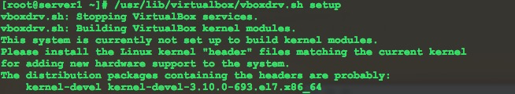
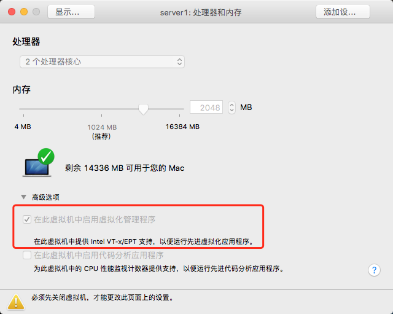
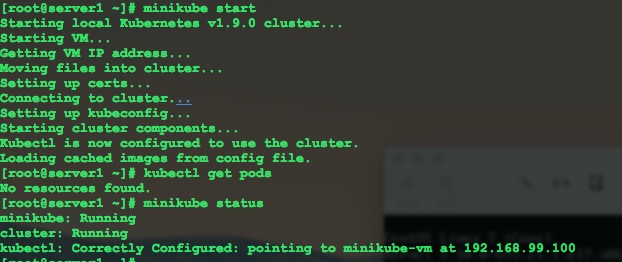

## 说明
如果要安装完整的kubernetes的话，对机器的配置要求比较高。所以官方推荐如果是本地运行的话，建议安装minikube。minikube具有kubernetes的所有核心组件。
官方说明：https://kubernetes.io/docs/user-journeys/users/application-developer/foundational/

## 安装环境
我使用的是Vmware创建的CentOS7的虚拟机。


## 安装minikube
使用下面的命令安装minukube
```
curl -Lo minikube https://storage.googleapis.com/minikube/releases/latest/minikube-linux-amd64 && chmod +x minikube && sudo mv minikube /usr/local/bin/
```

如果你执行完上面的安装命令之后，使用下面的命令启动minikube。
```
minikube start
```
如果你之前没有安装过vitualbox的话，会提示错误信息，让你安装vitualbox。

## 安装virtual-box
安装方法看这篇文章。不一样的是我安装的是5.2版本。
http://www.cnblogs.com/harry-h/p/6405433.html


注意，在执行/usr/lib/virtualbox/vboxdrv.sh setup命令的时候，可能会出现以下的错误：



这个时候，需要执行以下命令安装依赖的包：

```
yum install -y kernel-devel kernel-devel-3.10.0-693.3l7.x86_64
```
其实就是错误信息中提示你需要安装的包，复制安装就行了。安装完成之后，再执行上面的命令就没有问题了。

## 开启VM的虚拟化
如果遇到以下错误
```
This computer doesn't have VT-X/AMD-v enabled. Enabling it in the BIOS is mandatory
```
解决方法：


注意，需要先关机，这里才可以操作。


## 手动复制localkube到指定目录
如果遇到以下错误信息：
```
Error updating cluster: Error updating localkube from uri: Error creating localkube asset from url: Error opening file asset: /root/.minikube/cache/localkube/localkube-v1.9.0: open /root/.minikube/cache/localkube/localkube-v1.9.0: no such file or directory
```

解决办法：
去GitHub上下载
https://github.com/kubernetes/minikube/releases/download/v0.25.0/localkube
文件。然后复制到/root/.minikube/cache/localkube/中，并且重命名为localkube-v1.9.0。

## 安装kubectl
执行下面的命令安装kubectl：

```
curl -LO https://storage.googleapis.com/kubernetes-release/release/`curl -s https://storage.googleapis.com/kubernetes-release/release/stable.txt`/bin/darwin/amd64/kubectl
```

官方文档地址：https://kubernetes.io/docs/tasks/tools/install-kubectl/

## 结果
使用minikube start命令启动之后，如果启动成功了，可以使用minikube status查看minikube的状态。
